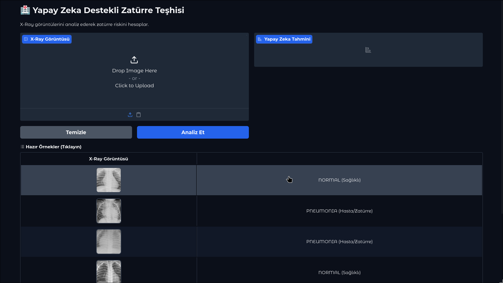
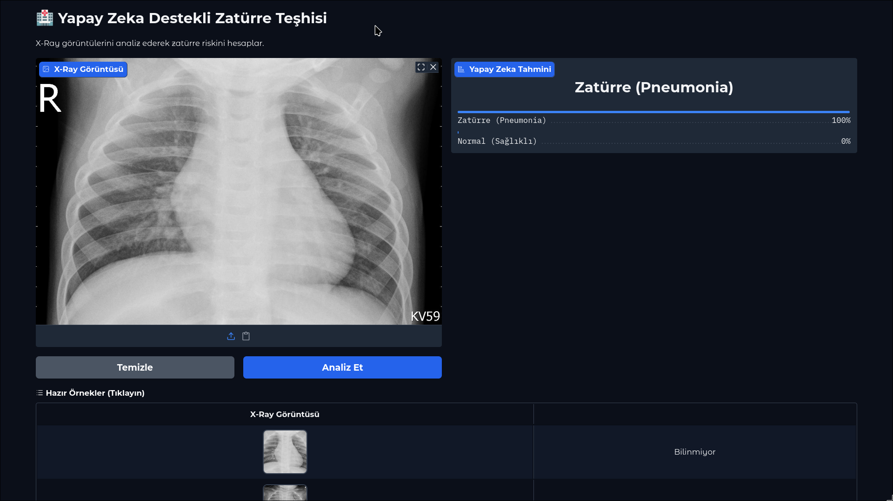

# 🏥 Derin Öğrenme ile Zatürre (Pneumonia) Tespiti


Bu proje, Derin Öğrenme (Deep Learning) teknikleri kullanılarak akciğer röntgen (X-Ray) görüntülerinden **Zatürre (Pneumonia)** hastalığını otomatik olarak tespit eden bir yapay zeka sistemidir.

Proje, **Transfer Learning (Transfer Öğrenme)** yöntemiyle **VGG16** mimarisi kullanılarak geliştirilmiş ve son kullanıcı için **Gradio** tabanlı etkileşimli bir web arayüzü sunulmuştur.


## 📋 İçindekiler
- [Proje Hakkında](#-proje-hakkında)
- [Veri Seti](#-veri-seti)
- [Model Mimarisi](#-model-mimarisi)
- [Kurulum ve Çalıştırma](#-kurulum-ve-çalıştırma)
- [Kullanım (Demo)](#-kullanım-demo)
- [Sonuçlar ve Metrikler](#-sonuçlar-ve-metrikler)

---

## 🧐 Proje Hakkında
Zatürre, dünya genelinde çocuk ve yaşlı ölümlerinin başlıca sebeplerinden biridir. Radyologların X-Ray görüntülerini incelemesi zaman alıcı olabilir ve yorgunluğa bağlı hatalar yapılabilir. Bu proje:
* Radyologlara yardımcı bir karar destek sistemi sunmayı,
* Teşhis sürecini hızlandırmayı,
* Derin öğrenmenin tıbbi görüntü işlemedeki başarısını göstermeyi amaçlar.

---

## 📊 Veri Seti
Projede Kaggle üzerinde bulunan **"Chest X-Ray Images (Pneumonia)"** veri seti kullanılmıştır.
* **Kaynak:** [Kaggle - Paul Mooney](https://www.kaggle.com/datasets/paultimothymooney/chest-xray-pneumonia)
* **İçerik:** 5,863 adet JPEG formatında X-Ray görüntüsü.
* **Sınıflar:**
    * `NORMAL` (Sağlıklı)
    * `PNEUMONIA` (Hasta - Bakteriyel/Viral)

---

## 🧠 Model Mimarisi
Projede sıfırdan bir CNN eğitmek yerine **Transfer Learning** yöntemi tercih edilmiştir.
* **Temel Model:** VGG16 (ImageNet ağırlıkları ile önceden eğitilmiş).
* **Neden VGG16?** Kenar, doku ve şekil algılama yeteneği halihazırda çok güçlüdür.
* **Özelleştirme:** Son katmanlar çıkarılarak, probleme özgü sınıflandırma katmanları eklenmiştir:
    1.  `Flatten`
    2.  `Dense` (512 Nöron, ReLU Aktivasyonu)
    3.  `Dropout` (0.5 - Overfitting'i önlemek için)
    4.  `Dense` (1 Nöron, Sigmoid - Binary Classification)

---

## 🔧 Kurulum ve Çalıştırma

Bu proje **NixOS** üzerinde **Devenv** kullanılarak geliştirilmiştir, ancak standart Python ortamlarında da çalışabilir.

### Yöntem 1: Devenv (Önerilen - NixOS Kullanıcıları İçin)
```bash
# 1. Projeyi klonlayın
git clone https://github.com/namaelsan/pneumonia-detection-cnn.git]
cd PROJE_ADIN

# 2. Geliştirme ortamına girin (Tüm bağımlılıklar otomatik kurulur)
devenv shell

# 3. Uygulamayı başlatın
python app.py

```

### Yöntem 2: Standart Python (Windows/Mac/Linux)

```bash
# 1. Sanal ortam oluşturun
python -m venv venv
source venv/bin/activate  # Windows için: venv\Scripts\activate

# 2. Bağımlılıkları yükleyin
pip install -r requirements.txt

# 3. Uygulamayı başlatın
python app.py

```

---

## 🖥 Kullanım (Demo)

Uygulama başlatıldığında terminalde bir link belirecektir (genellikle `http://127.0.0.1:7861`). Bu linke tarayıcıdan giderek arayüzü kullanabilirsiniz.

* **Resim Yükleme:** Bilgisayarınızdan bir X-Ray görüntüsü yükleyin.
* **Örnekler:** Sayfanın altındaki hazır örneklere tıklayarak modelin test verisi üzerindeki performansını anında görebilirsiniz.
* **Gerçek Etiket Kontrolü:** Örnek seçtiğinizde sol tarafta resmin gerçek etiketi, sağ tarafta ise modelin tahmini görünür.
<div>
   
   
</div>

---

## 📈 Sonuçlar ve Metrikler

Model, test veri seti üzerinde değerlendirilmiş ve aşağıdaki sonuçlar elde edilmiştir:

* **Doğruluk (Accuracy):** %88
* **F1-Score:** 0.9136
* **Recall (Duyarlılık):** 0.88 (Hastalığı yakalama başarısı)

### Karmaşıklık Matrisi (Confusion Matrix)

Aşağıdaki matris, modelin kaç adet "Hasta"yı doğru bildiğini ve kaç adet "Sağlıklı"yı karıştırdığını gösterir:


---

## 📝 Lisans

Bu proje eğitim amaçlı hazırlanmıştır. Veri seti Kaggle lisanslarına tabidir.
